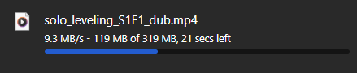

# 🎬 Anime Stream & Download API

> **Direct Anime Download API - No UI, Pure Functionality**

A lightweight Python API for streaming and downloading anime directly to your device. Built with Flask, ani-cli, and yt-dlp.

---

## 🎥 Live Demo & Proof



✅ **Verified Working** - High-speed downloads with stable API performance!

---

## ✨ Features

- **🚀 Direct Downloads**: Video files download directly to user's device
- **📦 Single File**: One Python file - simple deployment
- **⚡ Fast & Lightweight**: No UI overhead, pure API performance
- **🎭 Multi-Language**: English Sub/Dub, Japanese Raw support
- **🔍 Search Functionality**: Built-in anime search via MyAnimeList
- **📺 Movies & Series**: Support for both anime series and movies
- **🎬 Season Support**: Specify season numbers for multi-season anime

---

## 🚀 Quick Start

### **Installation (Under 2 Minutes)**

```bash
# 1. Install system dependencies
sudo apt update && sudo apt install -y python3 python3-pip ffmpeg git curl

# 2. Install ani-cli
sudo wget -O /usr/local/bin/ani-cli https://raw.githubusercontent.com/pystardust/ani-cli/master/ani-cli
sudo chmod +x /usr/local/bin/ani-cli

# 3. Install yt-dlp
sudo curl -L https://github.com/yt-dlp/yt-dlp/releases/latest/download/yt-dlp -o /usr/local/bin/yt-dlp
sudo chmod +x /usr/local/bin/yt-dlp

# 4. Run the app (Python dependencies auto-install)
python3 app.py
```

### **Access Your API**

- **Local**: `http://localhost:9079`
- **Network**: `http://YOUR_VPS_IP:9079`

---

## 📚 API Documentation

### **Base URL**
```
http://YOUR_VPS_IP:9079
```

### **1. Download Anime Episode**

Downloads a specific episode of an anime series.

**Endpoint:** `GET /`

**Parameters:**
- `name` (required): Anime name
- `season` (optional): Season number (default: 1)
- `episode` (required): Episode number
- `dubbed` (optional): yes/no (default: no)

**Examples:**
```bash
# Download Naruto Season 1 Episode 1 (Subbed)
curl "http://YOUR_VPS_IP:9079/?name=naruto&season=1&episode=1&dubbed=no" -O

# Download Attack on Titan Season 2 Episode 5 (Dubbed)
curl "http://YOUR_VPS_IP:9079/?name=attack-on-titan&season=2&episode=5&dubbed=yes" -O

# Download One Piece Episode 100
curl "http://YOUR_VPS_IP:9079/?name=one-piece&episode=100&dubbed=no" -O
```

**Browser Usage:**
```
http://YOUR_VPS_IP:9079/?name=naruto&season=1&episode=1&dubbed=no
```
Just paste in browser - file downloads automatically!

**Response:**
- **Success**: MP4 file download starts immediately
- **Error**: JSON error message
```json
{
  "error": "Could not find stream URL",
  "anime": "naruto",
  "season": "1",
  "episode": "1",
  "dubbed": false
}
```

---

### **2. Download Movie**

Downloads an anime movie.

**Endpoint:** `GET /`

**Parameters:**
- `movie` (required): Movie name
- `dubbed` (optional): yes/no (default: no)

**Examples:**
```bash
# Download "Your Name" (Subbed)
curl "http://YOUR_VPS_IP:9079/?movie=your-name&dubbed=no" -O

# Download "Spirited Away" (Dubbed)
curl "http://YOUR_VPS_IP:9079/?movie=spirited-away&dubbed=yes" -O

# Download "Demon Slayer Movie"
curl "http://YOUR_VPS_IP:9079/?movie=demon-slayer-mugen-train&dubbed=no" -O
```

**Browser Usage:**
```
http://YOUR_VPS_IP:9079/?movie=your-name&dubbed=no
```

**Response:**
- **Success**: MP4 file download starts immediately
- **Error**: JSON error message

---

### **3. Search Anime**

Search for anime by name.

**Endpoint:** `GET /search`

**Parameters:**
- `q` (required): Search query

**Examples:**
```bash
# Search for Naruto
curl "http://YOUR_VPS_IP:9079/search?q=naruto"

# Search for Attack on Titan
curl "http://YOUR_VPS_IP:9079/search?q=attack-on-titan"
```

**Response:**
```json
{
  "success": true,
  "query": "naruto",
  "count": 20,
  "results": [
    {
      "id": "naruto-m20",
      "mal_id": "20",
      "title": "Naruto",
      "cover": "https://cdn.myanimelist.net/images/anime/...",
      "episodes_count": 220,
      "score": 8.3,
      "synopsis": "...",
      "genres": ["Action", "Adventure", "Fantasy"],
      "status": "Finished Airing",
      "year": "2002",
      "type": "TV"
    }
  ]
}
```

---

### **4. Get Anime Info**

Get detailed information about a specific anime including all episodes.

**Endpoint:** `GET /info`

**Parameters:**
- `name` (required): Anime name

**Examples:**
```bash
# Get info for Naruto
curl "http://YOUR_VPS_IP:9079/info?name=naruto"

# Get info for One Piece
curl "http://YOUR_VPS_IP:9079/info?name=one-piece"
```

**Response:**
```json
{
  "success": true,
  "anime": {
    "id": "naruto-m20",
    "mal_id": "20",
    "title": "Naruto",
    "cover": "https://...",
    "episodes_count": 220,
    "score": 8.3,
    "synopsis": "...",
    "genres": ["Action", "Adventure"],
    "status": "Finished Airing",
    "year": "2002",
    "type": "TV",
    "episodes": [
      {
        "number": 1,
        "title": "Enter: Naruto Uzumaki!",
        "duration": "~24 min",
        "filler": false,
        "recap": false
      }
    ]
  }
}
```

---

### **5. API Status**

Check API health and available endpoints.

**Endpoint:** `GET /status`

**Example:**
```bash
curl "http://YOUR_VPS_IP:9079/status"
```

**Response:**
```json
{
  "status": "online",
  "version": "2.0-API",
  "ani_cli_installed": true,
  "yt_dlp_installed": true,
  "endpoints": {
    "download_episode": "/?name=ANIME_NAME&season=SEASON_NUM&episode=EP_NUM&dubbed=yes/no",
    "download_movie": "/?movie=MOVIE_NAME&dubbed=yes/no",
    "search": "/search?q=QUERY",
    "info": "/info?name=ANIME_NAME",
    "status": "/status"
  }
}
```

---

## 🎯 Use Cases

### **Example 1: Download Entire Season**

```bash
#!/bin/bash
# Download all episodes of Naruto Season 1

for ep in {1..220}; do
  curl "http://YOUR_VPS_IP:9079/?name=naruto&season=1&episode=$ep&dubbed=no" \
    -o "Naruto_S01E$(printf %03d $ep).mp4"
  echo "Downloaded episode $ep"
  sleep 2  # Be nice to the server
done
```

### **Example 2: Python Integration**

```python
import requests

# Download an episode
url = "http://YOUR_VPS_IP:9079/"
params = {
    "name": "naruto",
    "season": 1,
    "episode": 1,
    "dubbed": "no"
}

response = requests.get(url, params=params)
if response.status_code == 200:
    with open("naruto_ep1.mp4", "wb") as f:
        f.write(response.content)
    print("Downloaded successfully!")
```

### **Example 3: Search Before Download**

```bash
# 1. Search for anime
curl "http://YOUR_VPS_IP:9079/search?q=demon-slayer"

# 2. Get detailed info
curl "http://YOUR_VPS_IP:9079/info?name=demon-slayer"

# 3. Download specific episode
curl "http://YOUR_VPS_IP:9079/?name=demon-slayer&season=1&episode=1&dubbed=no" -O
```

---

## 🛠️ Technical Details

### **Stack**
- **Backend**: Flask (Python)
- **Anime Data**: ani-cli + Jikan API (MyAnimeList)
- **Downloads**: yt-dlp
- **Video Processing**: ffmpeg

### **Architecture**
- Single-file application (~400 lines)
- Zero database requirements
- Stateless API design
- Direct file streaming to client

### **Download Process**
```
1. User requests episode
2. API queries ani-cli for stream URL
3. yt-dlp downloads video to server
4. Flask sends file to user's device
5. File auto-downloads in browser
```

---

## 🔧 Advanced Configuration

### **Change Port**
Edit `app.py`:
```python
PORT = 8080  # Your custom port
```

### **Change Download Directory**
```python
DOWNLOAD_DIR = '/path/to/your/downloads'
```

### **Systemd Service**
```ini
[Unit]
Description=Anime Download API
After=network.target

[Service]
Type=simple
User=your-username
WorkingDirectory=/path/to/app
ExecStart=/usr/bin/python3 /path/to/app/app.py
Restart=always

[Install]
WantedBy=multi-user.target
```

Save to `/etc/systemd/system/anime-api.service`:
```bash
sudo systemctl daemon-reload
sudo systemctl enable anime-api
sudo systemctl start anime-api
```

### **Nginx Reverse Proxy**
```nginx
server {
    listen 80;
    server_name anime.yourdomain.com;
    
    client_max_body_size 2G;
    proxy_read_timeout 600s;

    location / {
        proxy_pass http://127.0.0.1:9079;
        proxy_set_header Host $host;
        proxy_set_header X-Real-IP $remote_addr;
    }
}
```

---

## 🐛 Troubleshooting

### **"ani-cli not installed" Error**
```bash
sudo wget -O /usr/local/bin/ani-cli https://raw.githubusercontent.com/pystardust/ani-cli/master/ani-cli
sudo chmod +x /usr/local/bin/ani-cli
```

### **"Could not find stream URL" Error**
- Check if ani-cli works: `ani-cli naruto`
- Verify anime name spelling
- Try searching first: `/search?q=anime-name`

### **Downloads Failing**
```bash
# Update yt-dlp
sudo yt-dlp -U

# Test yt-dlp manually
yt-dlp --version
```

### **Port Already in Use**
```bash
# Find process using port 9079
sudo lsof -i :9079

# Kill process
sudo kill -9 <PID>
```

---

## 📊 Performance

- **API Response**: < 500ms (search/info)
- **Download Start**: 2-5 seconds (stream URL fetch)
- **Download Speed**: Limited by yt-dlp and source
- **Concurrent Users**: Supports multiple simultaneous downloads
- **Memory Usage**: ~30MB idle, ~100-200MB per active download

---

## 🔒 Security & Privacy

- ✅ **Self-Hosted**: Complete control over your API
- ✅ **No Tracking**: Zero analytics or telemetry
- ✅ **No Ads**: Clean API responses
- ✅ **Local Storage**: Files saved on your server
- ✅ **Open Source**: Single file - inspect yourself

### **Recommended Security**
```bash
# Firewall (allow only specific IPs)
sudo ufw allow from YOUR_IP to any port 9079

# Or use Nginx with authentication
# Or run behind VPN (WireGuard/Tailscale)
```

---

## 🌟 Why Use This API?

### **vs Streaming Websites**
- ❌ Streaming Sites: Ads, trackers, region locks
- ✅ This API: Direct downloads, no interruptions

### **vs Manual ani-cli**
- ❌ ani-cli: Terminal only, manual per episode
- ✅ This API: Scriptable, batch downloads, remote access

### **vs Other Downloaders**
- ❌ Others: Complex setup, many dependencies
- ✅ This API: Single file, auto-install deps, clean API

---

## 📄 License

MIT License - Free to use, modify, and distribute.

---

## 🎓 Integration Examples

### **Discord Bot**
```python
@bot.command()
async def anime(ctx, name, episode):
    url = f"http://YOUR_VPS:9079/?name={name}&episode={episode}&dubbed=no"
    await ctx.send(f"Download: {url}")
```

### **Telegram Bot**
```python
@bot.message_handler(commands=['download'])
def download_anime(message):
    # Parse: /download naruto 1
    _, name, ep = message.text.split()
    url = f"http://YOUR_VPS:9079/?name={name}&episode={ep}"
    bot.send_message(message.chat.id, f"Download link: {url}")
```

### **Mobile App Integration**
```javascript
// React Native / Flutter
const downloadEpisode = async (anime, season, episode) => {
  const url = `http://YOUR_VPS:9079/?name=${anime}&season=${season}&episode=${episode}&dubbed=no`;
  // Use native download manager
  RNFetchBlob.config({ ... }).fetch('GET', url);
};
```

---

## 🚀 Roadmap

- [ ] Batch download endpoint (multiple episodes at once)
- [ ] Quality selection (360p, 720p, 1080p)
- [ ] Subtitle download support
- [ ] Authentication/API keys
- [ ] Rate limiting
- [ ] Download queue management
- [ ] WebSocket progress updates
- [ ] Thumbnail extraction

---

## 🤝 Contributing

This is intentionally kept as a single-file application for simplicity. For improvements:
1. Test thoroughly
2. Maintain single-file structure
3. Keep API simple and clean
4. Document all changes

---

## 💬 Support

For issues or questions:
- Check troubleshooting section above
- Review ani-cli documentation
- Open GitHub issue with details

---

## 🎉 Acknowledgments

- **ani-cli**: Amazing CLI tool for anime streaming
- **yt-dlp**: Reliable video downloader
- **Jikan API**: MyAnimeList data access
- **Flask**: Excellent web framework

---

## ⚠️ Legal Disclaimer

This tool is for educational purposes. Users are responsible for compliance with local laws and copyright regulations. Support official anime releases when possible.

---

**Made with ❤️ for anime lovers worldwide**

*Download responsibly. Support official releases.*
